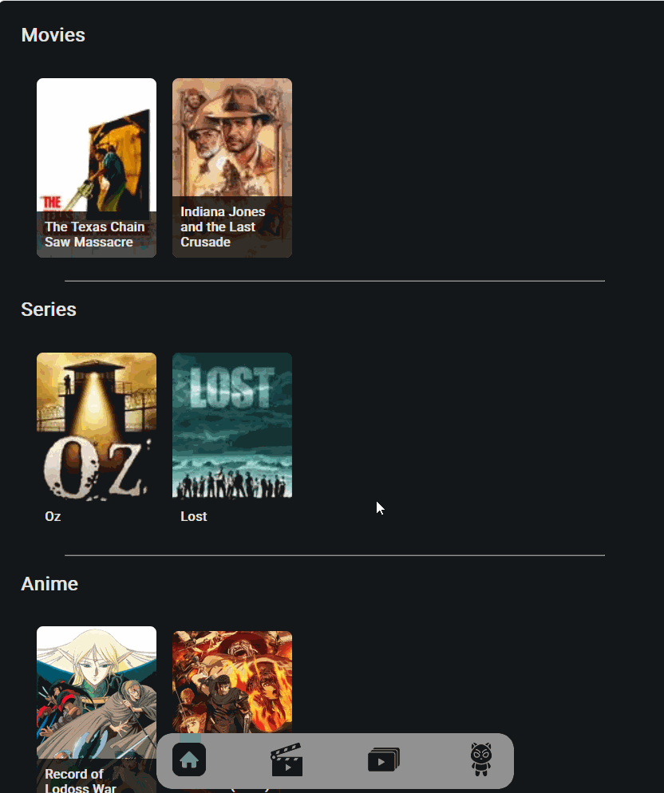

# Mirareru

A simple app to keep track of Movies, Series and Anime

## Description

I have beek keeping a note on my phone to note things I want to watch. I have also been wanting to dip my toes in Javascript for quite some time now. So I put the two together and Mirareru was born. It is my first full stack project, so rookie mistakes are expected.

It uses the TMDB API to search for movies and series and the AniList API to search for anime. 



### Prerequisites

You need to register for an API Token with TMDB.

### Instructions

1. Run npm install to get all required packages. You should end up with the following:
    ```
        better-sqlite3
        cors
        dotenv
        express    
    ```

2. Copy the .env.example to .env and set the  database location (if you wish to change it), the port you want the express server to listen to and the API Token you got from TMDB. Please note, that you might have to create the directory if it does not exist, otherwise you will get an error at the next step.   

3. Start the server
    ```
        node server.js
    ```

4. Point your browser to localhost:PORT or to [server.ip]:port


### Disclaimer

This project was made for my own personal use and was never intended for something more than that. Therefore, no energy was spent on assets. All icons (including the favicon) were found on [Magnific](https://www.magnific.com/app) and are all under their free licence. 

The search bar was found on [Medium](https://medium.com/100-days-in-kyoto-to-create-a-web-app-with-google/day-17-styling-a-search-box-like-googles-e17dd9074abe) and was made by [Masa Kudamatsu](https://medium.com/@masakudamatsu).

Various bits and pieces were lifted off straight from the internet (like Stackoverflow and other sources) and I had to resort to asking AI for help regarding CSS where I am clueless. 

### Roadmap

- [ ] Refactor code (right now it's a mess)
- [ ] Add custom filters for watch lists (like genres, text search, etc)
- [ ] Add item detail card
- [ ] Make app multi user and add the abilty to crate shared lists between users
